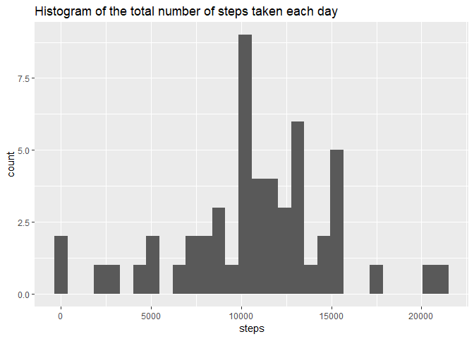
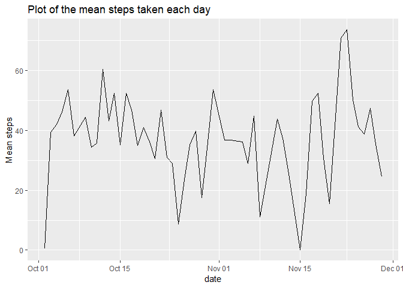
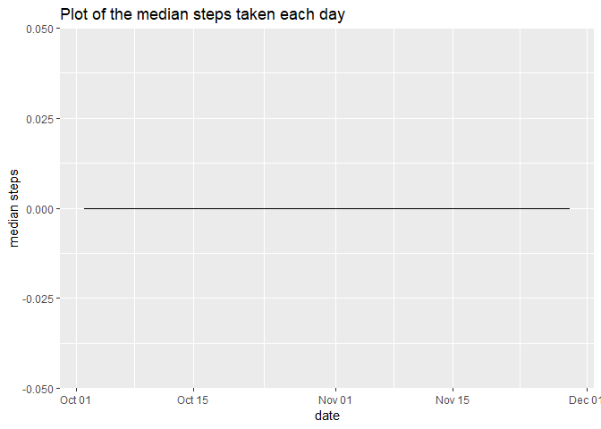
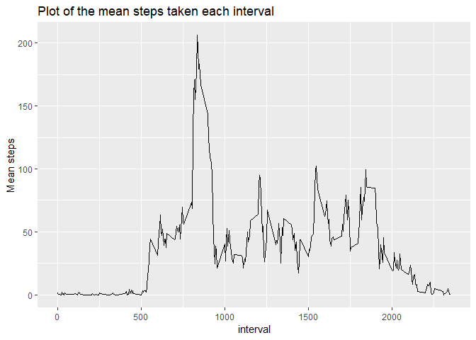
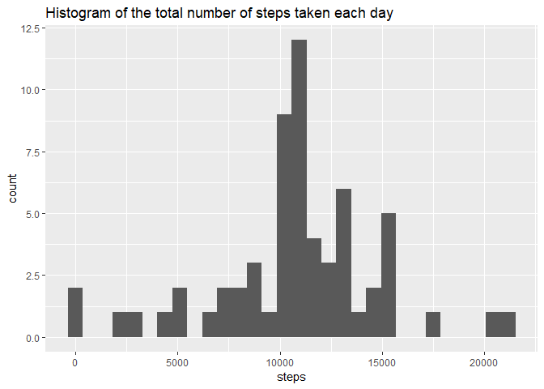
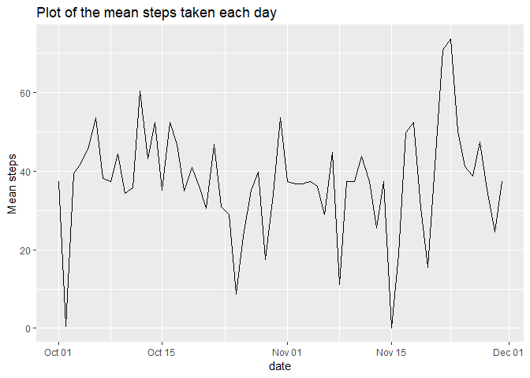
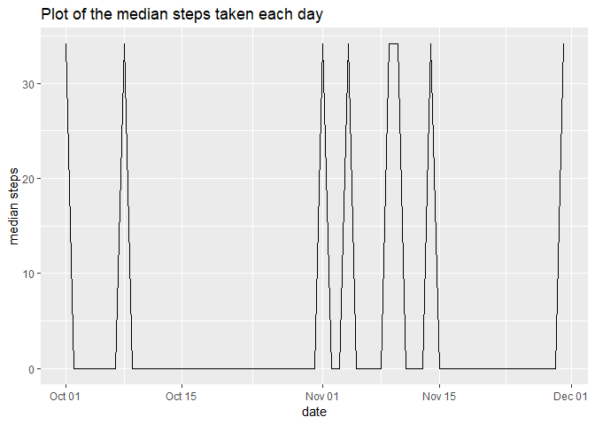
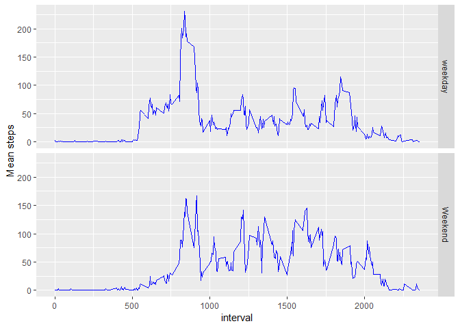

## Loading and preprocessing the data


```r
activity <- read.csv(file = "activity.csv" )

activity$date <- as.Date(x = as.character(activity$date) , format = "%Y-%m-%d" )

activity <- activity[complete.cases(activity) , ]
```


## What is mean total number of steps taken per day?


```r
library(dplyr)
```

```
## 
## Attaching package: 'dplyr'
```

```
## The following objects are masked from 'package:stats':
## 
##     filter, lag
```

```
## The following objects are masked from 'package:base':
## 
##     intersect, setdiff, setequal, union
```

```r
library(ggplot2)

df.hist <- as.data.frame(activity %>% group_by(date) %>% summarise_all(sum))

ggplot( df.hist , aes(x=steps)) + geom_histogram(bins = 30) + ggtitle("Histogram of the total number of steps taken each day")
```

<!-- -->

```r
df.mean <- as.data.frame(activity %>% group_by(date) %>% summarise_all(mean))

ggplot( df.mean , aes(y = steps , x = date)) + geom_line() + ggtitle("Plot of the mean steps taken each day") + ylab("Mean steps")
```

<!-- -->

```r
df.median <- as.data.frame(activity %>% group_by(date) %>% summarise_all(median))

ggplot( df.median , aes(y = steps , x = date)) + geom_line() + ggtitle("Plot of the median steps taken each day") + ylab("median steps")
```

<!-- -->

## What is the average daily activity pattern?


```r
library(dplyr)

library(ggplot2)

df.interval <- as.data.frame(activity %>% group_by(interval) %>% summarise_all(mean))

ggplot( df.interval , aes(y = steps , x = interval)) + geom_line() + ggtitle("Plot of the mean steps taken each interval") + ylab("Mean steps")
```

<!-- -->

```r
paste("Interval with maximum number of steps:" , df.interval$interval[which.max(df.interval$steps)] )
```

```
## [1] "Interval with maximum number of steps: 835"
```

## Imputing missing values

The strategy was to input the mean for that 5-minute interval.


```r
activity <- read.csv(file = "activity.csv" )

activity$date <- as.Date(x = as.character(activity$date) , format = "%Y-%m-%d" )

paste("total number of missing values in the dataset:" , sum(!complete.cases(activity)))
```

```
## [1] "total number of missing values in the dataset: 2304"
```

```r
for (i in 1:nrow(activity)) {
  
  if ( is.na(activity[i , "steps"])) {
    
    activity[i , "steps"] <- df.interval$steps[df.interval$interval == activity[i,"interval"]]
    
  }
  
}

library(dplyr)

library(ggplot2)

df.hist <- as.data.frame(activity %>% group_by(date) %>% summarise_all(sum))

ggplot( df.hist , aes(x=steps)) + geom_histogram(bins = 30) + ggtitle("Histogram of the total number of steps taken each day")
```

<!-- -->

```r
df.mean <- as.data.frame(activity %>% group_by(date) %>% summarise_all(mean))

ggplot( df.mean , aes(y = steps , x = date)) + geom_line() + ggtitle("Plot of the mean steps taken each day") + ylab("Mean steps")
```

<!-- -->

```r
df.median <- as.data.frame(activity %>% group_by(date) %>% summarise_all(median))

ggplot( df.median , aes(y = steps , x = date)) + geom_line() + ggtitle("Plot of the median steps taken each day") + ylab("median steps")
```

<!-- -->

We can see that the NA imputation does not change the distribution of the total number of steps taken each day.

## Are there differences in activity patterns between weekdays and weekends?


```r
activity$day <- as.factor(ifelse(weekdays(activity$date) %in% c("Saturday" , "Sunday") == TRUE , yes = "Weekend" , no = "weekday"))

df.mean <- as.data.frame(activity %>% group_by(interval , day) %>% summarise_all(mean))

ggplot( df.mean , aes(y = steps , x = interval)) + geom_line(colour = "blue")  + ylab("Mean steps") +  facet_grid(day ~ .)
```

<!-- -->
